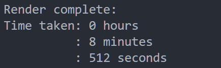
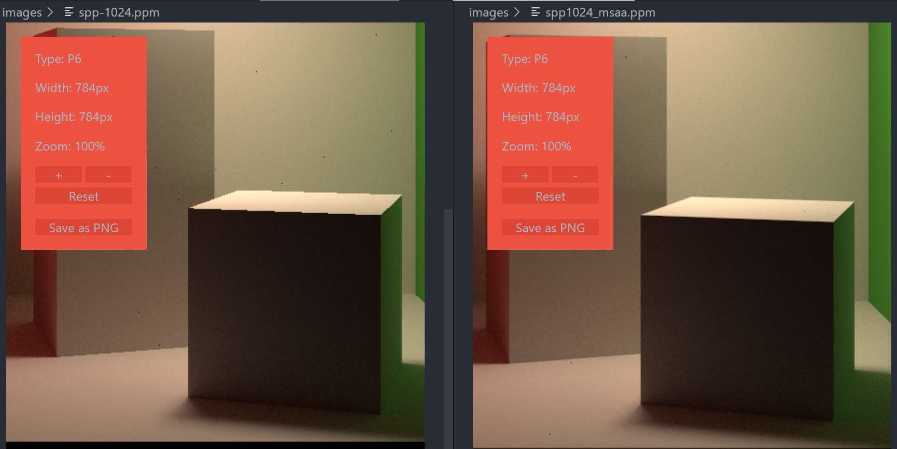
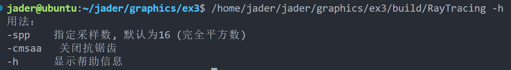
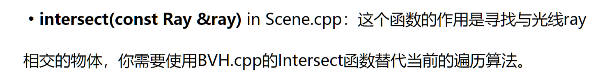

# 图形学作业3 路径追踪

## 完成项

1. Path Tracing算法实现

2. BVH加速求交

3. 加速

   - 基于OpenMP多线程框架实现多线程加速计算

     ```c++
     #pragma omp parallel for
     for (int i = 0; i < thread_size; i++)
     {
         para(eye_pos, framebuffer, scene, spp, imageAspectRatio,
              scale, i * thread_step, (i + 1) * thread_step);
     }
     ```

   - 优化get_random_float函数, 静态化dev, rng, dist, 减少每次创建造成的开销

     ```c++
     // 获取一个[0, 1]的随机数
     inline float get_random_float()
     {
         static std::random_device dev;
         static thread_local std::mt19937 rng(dev());
         static std::uniform_real_distribution<float> dist(0.f, 1.f);
     
         return dist(rng);
     }
     ```

     

   - 由于忘记截图保存, 此处仅留下了实现后的数据 (spp=1024)
      

4. MSAA实现

   - 1024spp: 
   - 

5. 为框架添加了选项功能

   

   

## 框架的疑问

在任务中, 实现分为了两步: ①路径追踪②BVH


```c++
Intersection Scene::intersect(const Ray &ray) const
{
    // TO DO Use BVH.cpp's Intersect function instead of the current traversal method
    Intersection dmin, tmp;
    for (auto i : objects)
    {
        tmp = i->getIntersection(ray);
        dmin = dmin.distance > tmp.distance ? tmp : dmin;
    }
    return dmin;
}
```

但是实际上, 在框架中的这个`intersect`函数会调用`Object`类的`getIntersection`函数, 在`Object`子类`MeshTriangle`中的实现为:

```c++
Intersection getIntersection(Ray ray)
{
    Intersection intersec;

    if (bvh)
    {
        intersec = bvh->Intersect(ray);
    }

    return intersec;
}
```

底层调用的还是bvh的intersect, 因此 如果不实现BVH的的话, 程序是无法正常运行的, 最后渲染结果为全黑(因为判断交点的`intersect`函数的结果全为不存在)